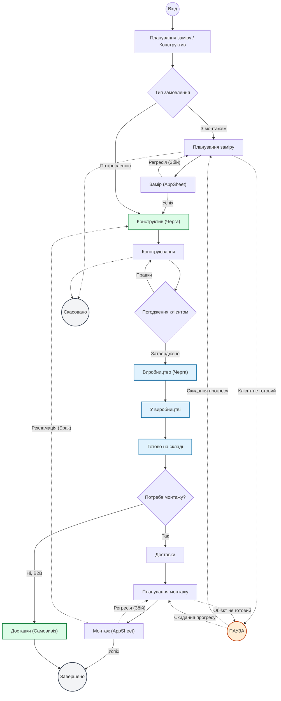

# Бізнес-процеси та функціонал модуля PLM / FSM (Етап 3)

Цей документ є основним артефактом, що детально описує всі бізнес-процеси та функціонал для модуля **PLM / FSM (Логістика, Заміри, Конструктив та Монтажі)**.

## Зміст
* [Етап 0: Загальні правила роботи додатку](#етап-0-загальні-правила-роботи-додатку)
    * [1. Резервне копіювання даних (Бек-апи)](#1-резервне-копіювання-даних-бек-апи)
    * [2. Архітектура: Модульний Моноліт з Рольовою Моделлю (RBAC)](#2-архітектура-модульний-моноліт-з-рольовою-моделлю-rbac)
    * [3. Захист від колізій (Мультиакаунтність та Блокування карток)](#3-захист-від-колізій-мультиакаунтність-та-блокування-карток)
    * [4. Строге логування (Audit Log)](#4-строге-логування-audit-log)
    * [5. Довідник мікро-автоматизацій](#5-довідник-мікро-автоматизацій-основа-для-e2e-тестування)
    * [6. Гнучкість налаштувань (No-code конфігуратор)](#6-гнучкість-налаштувань-no-code-конфігуратор)
    * [7. Технологічний стек та Інтеграції](#7-технологічний-стек-та-інтеграції)
    * [8. Система баг-репортів та діагностики (Blackbox)](#8-система-баг-репортів-та-діагностики-blackbox)
    * [9. Вбудована База Знань (Бібліотека інструкцій)](#9-вбудована-база-знань-бібліотека-інструкцій)
    * [10. Локальний ШІ-Асистент та Аналізатор (AI Copilot)](#10-локальний-ші-асистент-та-аналізатор-ai-copilot)
    * [11. Soft-Delete (Логічне видалення та архівування)](#11-soft-delete-логічне-видалення-та-архівування)
    * [12. Геокодування адрес та маршрути](#12-геокодування-адрес-та-маршрути)
    * [13. Офлайн-режим та Синхронізація (AppSheet)](#13-офлайн-режим-та-синхронізація-appsheet)
    * [14. Ідемпотентність операцій (Захист від дублювання)](#14-ідемпотентність-операцій-захист-від-дублювання)
    * [15. Дизайн інтерфейсу та UX-логіка вікон](#15-дизайн-інтерфейсу-та-ux-логіка-вікон)
    * [16. Інтеграція з IP-телефонією та смартфонами (CTI)](#16-інтеграція-з-ip-телефонією-та-смартфонами-cti)
    * [17. Терміноутворення та Дедлайни (SLA)](#17-терміноутворення-та-дедлайни-sla)
* [Етап 1: Вхід та редагування замовлень](#етап-1-вхід-та-редагування-замовлень)
    * [1. Вхід замовлень у систему](#1-вхід-замовлень-у-систему-створення-картки-замовлення)
    * [1.1 Синхронізація з Таблицею Виробництва](#11-синхронізація-з-таблицею-виробництва-на-етапі-релізу)
    * [1.2 Структура картки замовлення (Архітектура та Набір параметрів)](#12-структура-картки-замовлення-архітектура-та-набір-параметрів)
* [Етап 2: Робочий стіл (Планування замірів)](#етап-2-робочий-стіл-планування-замірів)
    * [1. Меню налаштування керівника](#1-меню-налаштування-керівника)
    * [2. Інтерфейс дашборда роботи оператора](#2-інтерфейс-дашборда-роботи-оператора)
    * [3. Функціонал роботи оператора](#3-функціонал-роботи-оператора)
* [Етап 3: Спеціальний стан «Пауза» (Відкладені та проблемні замовлення)](#етап-3-спеціальний-стан-пауза-відкладені-та-проблемні-замовлення)
* [Етап 4: Робота замірника на об'єкті](#етап-4-робота-замірника-на-обєкті)
* [Етап 5: Конструктив та Інжиніринг](#етап-5-конструктив-та-інжиніринг)
* [Етап 6: Виробництво (MES Інтеграція)](#етап-6-виробництво-mes-інтеграція)
* [Етап 7: Логістика та Планування монтажів](#етап-7-логістика-та-планування-монтажів)
* [Етап 8: Монтаж на об'єкті](#етап-8-монтаж-на-обєкті)

---

<strong style="font-size: 1.5em; cursor: pointer;">Етап 0: Загальні правила роботи додатку</strong>

Цей блок описує фундаментальні системні правила, які повинні бути реалізовані для безпечної та стабільної роботи всього модуля.

<strong style="font-size: 1.25em; cursor: pointer;">1. Резервне копіювання даних (Бек-апи)</strong>

Оскільки додаток працюватиме з SQL-базою даних, система повинна автоматично робити бек-апи.
*   **Частота:** 2 рази на день.
*   **Локація:** Автоматичне резервне копіювання забезпечується платформою Supabase (PITR та щоденні дампи).
*   **Шифрування:** Усі бекапи (особливо технічні дампи) обов'язково шифруються перед відправкою, оскільки вони містять PII (персональні дані клієнтів: ПІБ, адреси, телефони).
*   **Політика зберігання (Retention):** Налаштовано життєвий цикл копій. Наприклад, зберігати щоденні копії 7 днів, щотижневі — 1 місяць, після чого старі архіви автоматично видаляються.
*   **Відновлення та Алерти:**
    *   **Restore-drills:** Раз на місяць/квартал проводиться обов'язкове тестове розгортання бази з бекапу для перевірки його цілісності (бекап, що не відновлювався — це не бекап).
    *   **Алерти:** При будь-якому збої в системі бекапування Supabase система негайно генерує критичний алерт розробникам.
*   **Формати вивантаження (2 файли):**
    1.  **Читабельний формат (Excel / CSV / Google Таблиці):** Зріз актуальних замовлень для екстреного доступу.
    2.  **Технічний бек-ап (SQL-архів):** Повний дамп бази даних (також обов'язково включає дамп об'єктного сховища файлів — креслень DXF/PDF, фото).

<strong style="font-size: 1.25em; cursor: pointer;">2. Архітектура: Supabase як Backend та Рольова Модель (RLS)</strong>

Додаток будується **повністю на Supabase**. Supabase виступає як база даних, бекенд, авторизація та сховище. Жодних окремих серверів (NestJS/Node.js) не ставиться.
*   **Безпека (Row Level Security - RLS):** Головний замок системи. Правила доступу перевіряються безпосередньо в базі даних. Якщо користувач спробує прочитати або змінити рядок, до якого у нього немає доступу, база відхилить запит.
*   **Реєстрація та активація:** Нові користувачі при реєстрації отримують тимчасову роль `NEW_USER` та статус `is_active: false`. Вони не мають доступу до системи (бачать лише екран "Очікування підтвердження"), доки керівник не перейде в модуль "Співробітники", не активує їх і не призначить справжню роль.
*   **Ролі та Права (Базовий стек):** Таблиця `roles` містить поле `permissions` (JSONB). Роль надає користувачу "базовий стек" прав доступу (наприклад, бачити замовлення, керувати логістикою), однаковий для всіх носіїв цієї ролі.
*   **Тонке налаштування співробітників:** У модулі "Співробітники" керівник може індивідуально доналаштувати профіль користувача поверх його ролі: вказати філію, дозволені регіони, точку виїзду (для замірників) та колір відображення на календарі.
*   **Стандартні фільтри (Пам'ять користувача):** Кожен співробітник може зберігати власні пресети фільтрів (вибрані регіони, статуси) у своєму профілі (колонка `default_filters` в `profiles`). Це дозволяє завантажувати їх одним кліком після оновлення сторінки, щоб відразу отримати своє "звичне" робоче середовище.
*   **Функції бази (RPC) та Edge Functions:** Браузер **ніколи не пише напряму** у важливі таблиці. Будь-який запис, що потребує перевірки бізнес-логіки (наприклад, зміна статусу), йде через функцію в базі (RPC). Зв'язок із зовнішнім світом (AppSheet, MES) здійснюється через маленькі серверні функції — Edge Functions.
*   **UI як відображення:** Інтерфейс (React) лише приховує або блокує кнопки на основі прав користувача (Thin Client). RLS забезпечує неможливість обходу цих обмежень (Thick DB).
*   **Виняток (AppSheet):** Блоки, що виносяться в окремий додаток — це "Заміри", "Монтажі" (робота "в полі"), що синхронізуються через Edge Functions (які виступають як безпечний приймальник).

<strong style="font-size: 1.25em; cursor: pointer;">3. Захист від колізій (Мультиакаунтність та Блокування карток)</strong>

Система захищена від конфліктів збереження всередині додатку.
*   **Механіка блокування:** Якщо оператор "А" почав редагувати картку замовлення, для оператора "Б" можливість редагування блокується. При цьому інші можуть вільно **переглядати** цю картку (Read-only).
*   **Авто-оновлення (Refresh):** Коли оператор "А" зберігає картку, оператор "Б", який переглядав її в режимі Read-only, отримує автоматичне оновлення даних (або чітке повідомлення "Дані змінились") без необхідності оновлювати сторінку вручну.
*   **Автоматичний таймаут (Захист від втрати даних):**
    *   Максимальний час відкритої сесії редагування — **10 хвилин** (відображається таймер).
    *   За хвилину до зняття блокування система попереджає користувача.
    *   Після закінчення 10 хвилин система **автоматично зберігає** введені дані (або зберігає як "Чорновик") і знімає блокування, дозволяючи іншим працювати з карткою. Якщо користувач відійшов від комп'ютера, його робота не втрачається.

<strong style="font-size: 1.25em; cursor: pointer;">4. Строге логування (Audit Log) через Тригери</strong>

Всі користувачі повинні знаходитися в базі під власними унікальними логінами (Supabase Auth) для ведення прозорої історії змін.
*   **Архітектура (Тригери):** Audit Log реалізовано через тригери в базі даних. Коли рядок змінюється, база сама створює запис у журналі. Це гарантує, що жодна зміна не пройде повз, незалежно від того, хто її зробив (сайт, AppSheet чи MES).
*   **Append-Only:** Аудит-лог є незмінним. Навіть адміністратор системи не може змінити або видалити запис про історію дій.
*   **Фіксація "Було → Стало":** Логується не просто факт зміни, а точні старі та нові значення, а також **джерело** зміни (UI, AppSheet, MES).
*   **Права та Зберігання:** Перегляд Audit Log доступний лише визначеним ролям.
*   **Оптимізація бази:** Логуються всі ключові бізнес-переходи, зміни конфігурації в панелі адміністратора, зміна відповідальних, перенесення дат.

<strong style="font-size: 1.25em; cursor: pointer;">5. Довідник мікро-автоматизацій</strong>

<b>Автоматизація 1: Відправка нагадувань про "Паузу"</b>

*   **Подія:** Замовлення переведено в статус `PAUSED`
*   **Обробник:** Відкладена задача (`pgmq` / `pg_cron` всередині Supabase)
*   **Логіка:** Створюється задача-нагадування із заданою затримкою (наприклад, 7 днів), яка сповістить менеджера.

<b>Автоматизація 2: Зовнішні сповіщення та Хуки</b>

*   **Подія:** Зміна статусу
*   **Обробник:** Edge Function (Supabase)
*   **Логіка:** Тригер бази даних викликає Edge Function, яка формує текст повідомлення і відправляє його у зовнішні сервіси (Telegram, AppSheet), обробляючи відповіді та помилки.

<strong style="font-size: 1.25em; cursor: pointer;">6. Гнучкість налаштувань (No-code конфігуратор)</strong>

Додаток має інтерфейс налаштування процесів (Admin Panel) для керівника.
*   **Управління полями (Soft-hide та No-code):** Робочі столи, картки замовлень та вкладки не є "мертво впечатаними" в код. В адмінці є no-code інструментарій для переміщення цих блоків та додавання нових колонок чи "ячейок фіксації" для нових автоматизацій у міру розвитку додатку. Видалення поля — це завжди `soft-hide` (поле зникає з UI, але історичні дані за минулі роки залишаються в БД цілими).
*   **Машина станів (State Machine):** Статуси замовлень — це не простий список, а конфігурований граф. В адмінці жорстко задаються "дозволені переходи" та правила видимості UI (кнопок). **Повний перелік статусів та граф переходів винесено в окремий артефакт: [order_stages_and_pause_rules.md](file:///c:/hhgh/%D0%93%D0%BB%D0%BE%D0%B1%D0%B0%D0%BB%D1%8C%D0%BD%D0%B8%D0%B9%20%D0%BF%D0%BB%D0%B0%D0%BD/order_stages_and_pause_rules.md).** Це усуває виникнення "битих" станів.
*   **Логування:** Будь-які зміни конфігурації також записуються в Audit Log.

<strong style="font-size: 1.25em; cursor: pointer;">7. Технологічний стек та Інтеграції (Supabase Architecture)</strong>

**Головна ідея:** Supabase — це і є наш бекенд. 

*   **Backend та База Даних:** **Supabase (PostgreSQL 15+)**. Використовує RLS для безпеки, RPC для бізнес-логіки та тригери для автоматизації.
*   **Аутентифікація:** **Supabase Auth** (email/пароль + Google SSO). 
*   **Realtime:** Вбудований функціонал Supabase для живого оновлення екранів (без F5).
*   **Сховище файлів:** **Supabase Storage** для фото, креслень, актів із безпечними посиланнями.
*   **Черги та Розклад:** `pgmq` та `pg_cron` (вбудовані в базу) для нагадувань і відкладених задач.
*   **Зовнішні Інтеграції:** **Edge Functions** (Deno) для зв'язку з AppSheet, MES, геокодерами та телефонією.
*   **Frontend (Клієнт):** React 18+ + TypeScript + Vite (односторінковий застосунок). UI: Vanilla CSS / CSS Modules + Radix UI + FullCalendar + @dnd-kit. Управління станом: Supabase клієнт + локальний стан.
*   **Карти та Маршрути:** **MapLibre GL** (векторні тайли) + OSRM (маршрути). Геокодер — сторонній хмарний сервіс (LocationIQ, Mapbox).

**Інтеграційна стратегія:**
*   **PLM ↔ MES:** MES шле повідомлення (Webhook), які приймає наша Edge Function. Функція застосовує зміни до бази через RPC, зберігаючи безпеку та перевірку статусів.
*   **PLM ↔ AppSheet:** AppSheet працює через нашу Edge Function як «приймальник» (ідемпотентні запити).
*   **PLM ↔ 1С:** Ми пишемо контакти в 1С; статуси виробництва — лише читаємо.

<strong style="font-size: 1.25em; cursor: pointer;">8. Система баг-репортів та діагностики (Blackbox)</strong>

Для швидкого виправлення помилок реалізовано внутрішню систему "чорний ящик".
*   **Збір телеметрії:** Скріншот, лог дій мишки (`rrweb`), консольні помилки, стан БД.
*   **Захист PII та Retention:** Оскільки скріншоти та лог `rrweb` містять персональні дані клієнтів (телефони, адреси):
    *   Доступ до "Плеєра" (записів багів) суворо обмежено політикою доступу (Admin/Tech Lead). Це не повинно стати неконтрольованою, "другою базою" PII.
    *   Застосовується політика автоочищення "важких" логів та записів (наприклад, видалення старше 30 днів).

<strong style="font-size: 1.25em; cursor: pointer;">9. Вбудована База Знань (Бібліотека інструкцій)</strong>

Вбудований довідник користувача з візуальними поясненнями, що динамічно наповнюється при розробці нових фіч.

<strong style="font-size: 1.25em; cursor: pointer;">10. ШІ-Асистент та Аналізатор (AI Copilot)</strong>

*   **Безпека (Тільки читання):** AI лише **читає** дані (нічого не змінює!) і бачить тільки те, що дозволено роллю. Ключ — на сервері (в Edge Function), не в браузері.
*   **Розмежування відповідальності:** AI працює з "сенсами" та пріоритетами, не дублюючи жорстку бізнес-логіку.
*   **Захист фінансових даних:** Видача відповідей від ШІ перевіряється на відповідність RLS користувача (менеджер не зможе дізнатися собівартість чи маржу, якщо він не має прав на ці поля).

<strong style="font-size: 1.25em; cursor: pointer;">11. Soft-Delete (Логічне видалення та архівування)</strong>

*   **Жодного фізичного видалення:** Замовлення, картки клієнтів або інші важливі сутності ніколи не видаляються з бази даних назавжди (фізичний DELETE відсутній в API).
*   **Скасування:** Замість цього використовується логічне видалення (soft-delete): записи переводяться в статус "Архів" або "Скасовано".
*   **Причина:** При скасуванні замовлення система вимагає обов'язкове текстове пояснення причини.

<strong style="font-size: 1.25em; cursor: pointer;">12. Геокодування адрес та маршрути</strong>

Для мапи й побудови маршрутів текстова адреса є ненадійною (українські новобудови часто геокодяться з помилками).
*   **Пайплайн Геокодування:** Кожна введена адреса (Адреса -> Координати Lat/Lng).
*   **Ручна корекція:** Диспетчер має можливість в інтерфейсі "схопити" пін і вручну перетягнути його на правильне місце (координати перезаписуються). Маршрути будуються тільки по координатах.

<strong style="font-size: 1.25em; cursor: pointer;">13. Офлайн-режим та Синхронізація (AppSheet)</strong>

Оскільки замірники, монтажники та водії часто працюють у зонах без зв'язку (підвали, віддалені об'єкти):
*   Мобільний додаток AppSheet обов'язково налаштовується на роботу в **Offline-режимі**.
*   Працівник може заповнити необхідні поля (зробити фото, підписати акт тощо) та зберегти дані без інтернету.
*   При відновленні мережі додаток автоматично відправляє дані на сервер.

<strong style="font-size: 1.25em; cursor: pointer;">14. Ідемпотентність операцій (Захист від дублювання)</strong>

Система захищена від дублювання дій (подвійний клік на "Зберегти" або повторний вебхук).
*   Для кожної критичної операції генерується `Idempotency Key` (унікальний ключ транзакції). Якщо бекенд отримує запит з тим самим ключем вдруге, він повертає "Успіх", але не виконує запис повторно.

<strong style="font-size: 1.25em; cursor: pointer;">15. Дизайн інтерфейсу та UX-логіка вікон</strong>

Щоб забезпечити єдиний стандарт того, як додаток буде виглядати і "відчуватись", застосовуються наступні UX правила:
*   **Сучасний та швидкий інтерфейс (SPA):** Додаток працює як Single Page Application (без перезавантаження сторінок при переходах). Підтримує темну та світлу теми.
*   **Логіка відкривання вікон (Без втрати контексту):**
    *   **Бокові панелі (Side Drawers):** Основний спосіб роботи з картками замовлень. При кліку на замовлення в таблиці, картка виїжджає з правої частини екрану, дозволяючи користувачу бачити картку і одночасно не втрачати загальну таблицю/мапу на фоні.
    *   **Модальні вікна (Pop-ups):** Використовуються виключно для швидких дій, що потребують підтвердження (скасування замовлення, вікно "Blackbox" або швидке завантаження файлу).
    *   **Вкладки (Tabs) всередині картки:** Щоб уникнути довгого скролу, картка замовлення всередині розбита на вкладки (Конструктив, Фінанси, Логістика).
*   **Глобальний пошук (Command Palette):** Наявність швидкого пошуку на всіх екранах (наприклад, по `Ctrl+K`), який шукає відразу по всіх сутностях (замовленням, клієнтам, телефонам).
*   **Адаптивність (Desktop-First):** Основний фокус на десктопну версію (великі монітори). Мобільна веб-версія має спрощений вигляд: замість таблиць — компактні картки (list view). *(Повноцінна робота "в полі" йде через AppSheet).*
*   **Система нотифікацій (Toast):** Ненав'язливі спливаючі повідомлення в кутку екрану про успішне збереження, оновлення статусу чи помилки.

<strong style="font-size: 1.25em; cursor: pointer;">16. Інтеграція з IP-телефонією та смартфонами (CTI)</strong>

Для забезпечення безперервної та ефективної комунікації (нульовий етап обробки звернень) система глибоко інтегрується з телефонією та робочими Android-смартфонами:
*   **Робочі столи менеджерів (Pop-up при вхідному дзвінку):** При вхідному дзвінку система автоматично ідентифікує номер. На робочому столі диспетчера миттєво з'являється Pop-up картка. Менеджер ще до підняття слухавки бачить контекст клієнта.
    *   *(Технічно: Webhooks від провайдера IP-телефонії йдуть в нашу Edge Function, яка робить запис у БД, що миттєво пушиться на фронт через Supabase Realtime).*
*   **Журнал дзвінків (Call Log):** Кожен телефонний дзвінок записується в окрему таблицю, що автоматично фіксує факт дзвінка, його тривалість та прив'язує цей запис до таймлайну картки відповідного замовлення (і в Audit Log через тригер).
*   **Вихідні дзвінки в 1 клік (Click-to-Call):** У картці замовлення номери клієнта є клікабельними. Через Edge Function надсилається команда на закріплений смартфон.
*   **Додаток AppSheet (Для замірників):** Інтерфейс замірника формує швидкі кнопки дій (`Подзвонити`, `Маршрут`).

<strong style="font-size: 1.25em; cursor: pointer;">17. Подієво-орієнтована архітектура (Supabase Webhooks & Realtime)</strong>

Найголовніший архітектурний патерн системи. Будь-яка важлива зміна публікує подію, на яку реагує система. Це ліквідує необхідність "точкових" інтеграцій.
*   **Database Webhooks:** Зміна стану в таблицях Supabase генерує подію (наприклад, через тригер), яка відправляється в нашу Edge Function.
*   **Realtime:** Клієнти (браузери) слухають зміни в базі напряму через Supabase Realtime, що дозволяє миттєво оновлювати дашборди без опитувань.

<strong style="font-size: 1.25em; cursor: pointer;">18. Надійна доставка подій (pgmq)</strong>

Гарантує, що жодна подія не загубиться при збої мережі (наприклад, між PLM та AppSheet).
*   **Механіка:** Черга подій живе в тій же самій базі даних (`pgmq`). Подія пишеться в чергу в тій самій транзакції, що й зміна стану картки. 
*   **Безпека (DLQ та Моніторинг):** Невдалі відправки йдуть у чергу-відстійник (DLQ - Dead-letter queue), що миттєво генерує алерт для оперативного реагування.

<strong style="font-size: 1.25em; cursor: pointer;">19. Фонова обробка та черги задач (pg_cron та pgmq)</strong>

Всі важкі або відкладені операції виконуються асинхронно безпосередньо в базі даних. Жодних окремих серверів-воркерів (на кшталт Redis/BullMQ) не встановлюється.
*   **Сценарії:** Геокодинг адрес, нагадування про вихід з "Паузи" через 3/7 днів, бекапи.
*   *Приклад:* Пауза 7 днів — це задача, запланована через розклад `pg_cron` або відкладена в `pgmq`, яка просто чекає свого часу всередині Supabase.

<strong style="font-size: 1.25em; cursor: pointer;">20. Канонічна таймзона (UTC)</strong>

*   **Правило:** Всі дати та час у базі даних (та при синхронізації з AppSheet / MES) зберігаються виключно в **UTC**.
*   **Відображення:** Перетворення в `Europe/Kyiv` відбувається виключно на клієнті (фронтенді) під час рендеру. Це унеможливлює баги при зміні літнього/зимового часу.

<strong style="font-size: 1.25em; cursor: pointer;">21. Об'єктне сховище файлів (Supabase Storage)</strong>

Гарячі файли (DXF, PDF, фото з монтажів) зберігаються в інтегрованому **Supabase Storage**.
*   **Переваги:** S3-сумісне сховище, вбудована інтеграція з базою (можливість прив'язати файли до конкретних карток через таблиці бази), підтримка RLS для файлів, пресигновані URL для безпечного доступу з AppSheet.
*   **Резервне копіювання:** Бекапи обов'язково включають файли зі Storage (відповідно до плану бекапів).

<strong style="font-size: 1.25em; cursor: pointer;">22. Multi-tenancy (Ізоляція по філіях)</strong>

Всі дані в системі партиційовані/ізольовані за контекстом "Філії" на рівні бекенду. 
*   **Реалізація:** Row-level isolation. У кожній доменній таблиці обов'язково є колонка `branch_id`. На рівні бекенду працює глобальний middleware, який автоматично підставляє фільтр за філією поточного користувача під час запитів до БД. Це усуває "людський фактор" розробників (запобігає ситуаціям "забули написати WHERE branch_id = X") і надійно блокує витік даних між філіями.
*   **Крос-філіальні замовлення:** Сценарії передачі замовлення між філіями (cross-branch handoff, наприклад, замір у Львові, монтаж у Києві) — це окремий протокол, який буде описано додатково.

<strong style="font-size: 1.25em; cursor: pointer;">23. Гнучка типізація замовлень (Feature Flags / Пропуск етапів)</strong>

Окрім базової ізоляції по філіях, замовлення можуть мати різні типи та набори прапорців (наприклад: `тип: 'по кресленню'`, `потребує_монтажу: false`).
*   **Пропуск етапів (State Machine Bypass):** Система використовує конфігуровані теги (Feature Flags) для замовлень. Якщо замовлення йде «по кресленню», машина станів автоматично пропускає етап «Замір». Таке замовлення фізично не потрапляє у вибірку (query) для робочого столу диспетчера замірів.
*   **Масштабованість:** Архітектура бази даних та бекенду будується так, щоб у майбутньому можна було безболісно додавати нові ідентифікатори-перемикачі, які впливатимуть на фільтрацію замовлень на різних дашбордах та змінюватимуть граф переходів без переписування ядра системи.

<strong style="font-size: 1.25em; cursor: pointer;">24. Міграції БД та Інтеграційні контракти</strong>

*   **Контракти:** Взаємодія з зовнішніми системами (AppSheet, MES) відбувається через Edge Functions згідно з узгодженими контрактами обміну (як `mes-contract.md`). Немає потреби у важкій формалізації (OpenAPI/AsyncAPI) на старті.
*   **Міграції (Schema Migrations):** Будь-яка зміна структури БД проводиться строго через **SQL-міграції Supabase** (файли міграцій). Soft-hide в адмінці змінює лише UI-метадані, ніколи не зачіпаючи фізичні колонки таблиць руками.

<strong style="font-size: 1.25em; cursor: pointer;">25. Агент-Сісадмін (Watchdog та Авто-моніторинг)</strong>

Оскільки систему обслуговує одна людина, критично необхідний автоматичний наглядач — комплекс "шпигунів" та тестів, які гарантують відсутність тихих збоїв чи втрати даних.
*   **Синтетичні тести (E2E):** Регулярний запуск автоматичних скриптів, які імітують дії користувача (створення замовлення, зміна статусів, перевірка інтеграцій), гарантуючи, що головні бізнес-процеси працюють.
*   **DB Watchdogs (pg_cron):** Заплановані SQL-скрипти, які постійно перевіряють цілісність даних (аномалії): пошук замовлень без статусу, завислих транзакцій, черг (DLQ), що переповнюються, або замовлень, які безслідно зникли з активної роботи.
*   **Логування інтеграцій:** Кожен запит від/до AppSheet, MES чи 1С логується в окремій таблиці `integration_logs` зі статусом успішності та payload-ом.
*   **Система Алертів:** Будь-яка виявлена аномалія або помилка в DLQ генерує подію, яка через Edge Function миттєво відправляє сповіщення (Telegram-бот / Sentry) адміністратору з прямим посиланням на проблемний запис чи лог.

---

<strong style="font-size: 1.5em; cursor: pointer;">Глобальний Життєвий Цикл Замовлення (Order Lifecycle)</strong>

У цьому розділі описано наскрізний шлях (Workflow) замовлення в системі від створення до повного закриття. Система підтримує два основних типи процесу, які розгалужуються залежно від потреб клієнта.

### Блок-схема процесу (Flowchart)

*Легенда: Зелений колір — B2B Bypass (пропуск етапів). Синій колір — Автономний зовнішній модуль MES. Оранжевий — стан Паузи.*

> **ВАЖЛИВО:** Повний перелік технічних підстатусів (Enum) та правила їх переходу знаходяться в єдиному канонічному документі: **[order_stages_and_pause_rules.md](file:///c:/hhgh/PLM%20module/InstructionsRules/order_stages_and_pause_rules.md)**.
> Нижче наведено спрощений опис сценаріїв за Макро-Етапами.

<strong style="font-size: 1.25em; cursor: pointer;">Сценарій 1: Повний цикл (Замір → Виробництво → Монтаж)</strong>

Це класичний, найдовший флоу для замовлень "під ключ".
1. **Вхід та Верифікація:** 
   - Замовлення створюється одразу в етапі **Планування заміру** (якщо повний цикл) або **Конструктив** (якщо по кресленню).
2. **Планування Заміру:** 
   - Замовлення з'являється на дашборді Логіста замірів.
   - *Штатно:* Логіст призначає дату та замірника на мапі.
   - *Нештатно (Немає зв'язку / Не готово):* Логіст відправляє замовлення на **Паузу**.
3. **Замір на об'єкті:**
   - Замірник отримує пуш в AppSheet, приїжджає на об'єкт.
   - *Штатно:* Замір виконано, акти підписані, фото завантажені. Перехід у **Конструктив**.
   - *Нештатно:* Замірник фіксує проблему. Відбувається **Регресія** назад у Планування заміру.
4. **Конструктив та Інжиніринг:**
   - Замовлення потрапляє на Kanban-дошку інженерів.
   - *Штатно:* Конструктор розробляє КД, погоджує з клієнтом. Перехід у **Виробництво**.
5. **Виробництво (Синхронізація з MES):**
   - Далі PLM лише "слухає" статуси від MES (Розкрій, Фрезерування, Склейка).
   - *Штатно:* MES надсилає фінальний статус "Виготовлено". Перехід у **Доставки**.
6. **Доставки та Планування Монтажу:**
   - Логіст планує вивезення виробу. Оператор монтажів планує виїзд бригади.
7. **Монтаж на об'єкті:**
   - Монтажники звітують через AppSheet.
   - *Нештатно (Рекламація):* Клієнт не приймає виріб. Замовлення генерує дочірню рекламацію (в майбутньому).
   - *Штатно:* Акт підписано. Перехід: **Завершено**.

<strong style="font-size: 1.25em; cursor: pointer;">Сценарій 2: По кресленню (Без заміру та без монтажу)</strong>

Скорочений флоу для партнерів (B2B). Завдяки архітектурі State Machine Bypass, замовлення "перестрибує" непотрібні етапи.

1. **Вхід та Верифікація:**
   - При створенні картки обирається тип: "По кресленню".
2. **Пропуск логістики:**
   - Система минає статуси Заміру.
   - Перехід: Одразу на Kanban-дошку конструкторів.
3. **Конструктив та Погодження:**
   - Створення КД на основі наданих B2B-партнером креслень.
4. **Виробництво (Синхронізація з MES):**
   - Очікування статусу "Виготовлено" від MES.
5. **Пропуск монтажу (Самовивіз):**
   - Після виготовлення система минає статуси Монтажу.
   - Замовлення переходить у статус Самовивозу на етапі **Доставки**.
   - Клієнт/дилер забирає виріб зі складу. Перехід: **Завершено**.

<strong style="font-size: 1.25em; cursor: pointer;">Універсальні зациклення та патерни</strong>

*   **Пауза (Глобальний рубильник):** Доступна майже на всіх етапах до монтажу. Повернення з Паузи завжди відбувається рівно в той етап (status), з якого замовлення в неї зайшло (завдяки збереженню `previous_status`).
*   **Погодження (Approval Loop):** На етапі Конструктиву або після нього креслення може бути відправлено клієнту/дилеру на погодження. Якщо клієнт вносить правки, замовлення повертається в `ENGINEERING_IN_PROGRESS` для коригування, після чого знову йде на погодження. Цей цикл повторюється до отримання `APPROVED_FOR_PRODUCTION`.
*   **Рекламація (Зациклення назад):** Створюється дочірній об'єкт "Рекламація", який успадковує всі креслення батьківського замовлення, але отримує найвищий пріоритет (Hot) і йде по скороченому колу (Конструктив → Виробництво → Монтаж). Батьківське замовлення тим часом блокується від остаточного закриття.
*   **Скасування (`CANCELLED`):** Замовлення може бути скасовано менеджером (з обов'язковою причиною), але тільки якщо воно ще не перейшло в статус `PRODUCTION_IN_PROGRESS` (щоб не списувати матеріал дарма). Якщо виріб вже ріжуть — скасування блокується на рівні State Machine і потребує прав Супер-адміна для зупинки процесу.

<strong style="font-size: 1.25em; cursor: pointer;">17. Терміноутворення та Дедлайни (SLA)</strong>

Щоб замовлення не "зависали" на етапах і не зривали загальний термін здачі об'єкта, система автоматично керує дедлайнами:
*   **Нормативи часу (SLA):** У базі даних (через спеціальний довідник `stage_slas`) для кожного етапу (`status`) та типу замовлення зберігається норматив часу (в годинах або днях), який виділяється на його виконання (наприклад, 48 годин на конструювання). Керівник може змінювати ці нормативи через UI без розробника.
*   **Автоматичний розрахунок:** Коли замовлення переходить на новий етап (спрацьовує `change_order_status`), система автоматично розраховує `current_stage_deadline` (Дедлайн поточного етапу) шляхом додавання SLA до поточного часу.
*   **Глобальний дедлайн:** Крім дедлайну етапу, кожне замовлення має `global_deadline` — загальну дату здачі виробу.
*   **Індикація в UI:** Замовлення, у яких дедлайн поточного етапу минув, відображатимуться в усіх списках, канбан-дошках та дашбордах з червоними індикаторами. Якщо до дедлайну залишилося менше визначеного часу (наприклад, < 24 год), використовується оранжевий колір ("Горять").
*   **Фільтрація:** Диспетчер та керівники можуть швидко відфільтрувати список замовлень за параметрами "Прострочені" або "Спливають сьогодні".

---

<strong style="font-size: 1.5em; cursor: pointer;">Етап 1: Вхід та редагування замовлень</strong>

Цей етап ініціює роботу модуля PLM / FSM після того, як замовлення було прораховано та підтверджено.

<strong style="font-size: 1.25em; cursor: pointer;">1. Вхід замовлень у систему (Створення картки замовлення)</strong>

Процес створення замовлення передбачає кілька важливих кроків захисту та валідації:

1.  **Детекція дублів:** До того, як картка буде збережена, система перевіряє введені дані (ПІБ, телефон, адреса). Якщо оператор копіпастить замовлення, яке вже існує, з'явиться алерт-попередження.
2.  **Завантаження та парсинг файлів:** Оператор завантажує два ключових файли — **Бланк погодження (PDF)** та **Креслення (DXF)**. Система перевіряє їх на формат та розмір, а далі намагається розпізнати текст у PDF для автозаповнення.
3.  **Екран перевірки парсингу:** Оскільки автозаповнення часто парситься криво, система відкриває екран верифікації ("що розпізнано / що треба дозаповнити"), де всі витягнуті дані підсвічуються для зручної ручної перевірки оператором.
4.  **Чорновик vs Випуск в планування:** 
    *   **Чорновик:** Можна зберегти недозаповнену картку як "Чорновик" (з нею не можуть працювати інші відділи).
    *   **Випуск:** Тільки після повного заповнення обов'язкових полів і натискання відповідної кнопки, замовлення переходить у статус «Очікує планування заміру».

<strong style="font-size: 1.25em; cursor: pointer;">1.1 Синхронізація з Таблицею Виробництва (на етапі релізу)</strong>

Оскільки частина функціоналу залишається в Google Таблицях (вкладка "Імпорт"), синхронізація налаштована за строгими правилами, щоб уникнути хаосу (реалізується як підписник `sheets_sync` на шину подій §17 через outbox §18, де Sheets API виступає лише як транспорт):

*   **Унікальний Ключ (External ID):** Для зіставлення замовлень між нашим додатком, Таблицею та ERP (наприклад, 1С) використовується чіткий, незмінний ідентифікатор (External ID / Номер 1С). Синхронізація за "назвою + адресою" заборонена, оскільки вона призводить до "склейок" або дублів.
*   **Матриця "Власника істини" (Ownership Matrix):** Дані розділені на зони відповідальності:
    *   **Push-only (Ми володіємо):** Контакти, адреса, тип робіт, коментарі менеджерів. Система пушить їх в таблицю і перезаписує там.
    *   **Pull-only (Таблиця володіє):** Статуси виробництва. Система лише зчитує їх з таблиці. Якщо статус змінено в Таблиці руками, наш додаток підтягне його (це виключає "перетирання" табличних статусів нашим додатком).
*   **Мапінг за Назвами (а не індексами):** Зчитування та запис у Google Таблицю відбувається суворо за **іменами колонок**, а не за їх індексами. Перед записом система валідує схему. Якщо хтось вставив новий стовпець у таблицю і зсунув дані — запис блокується і летить алерт. Запис "наосліп" заборонено.
*   **Ліміти Sheets API:** При Pull-оновленнях статусів використовуються пакетні запити для дотримання лімітів Google API (≈60 req/min на користувача).

<strong style="font-size: 1.25em; cursor: pointer;">1.2 Структура картки замовлення (Архітектура та Набір параметрів)</strong>

Оскільки замовлення містить велику кількість параметрів (від 100 до 150), дані розділяються на логічні блоки в інтерфейсі (через вкладки) та на нормалізовані таблиці в базі даних. Нижче наведено ключові поля з вказанням їхнього **джерела** (звідки система їх бере: парсинг, ручне введення, інтеграції чи автоматика).

### Блок 1. Шапка (Summary) та Ідентифікація
| Поле | Опис / Відповідає за | Джерело даних | Формат даних |
| :--- | :--- | :--- | :--- |
| **ID / № Замовлення** | Унікальний ідентифікатор у системі. | Автоматично (Система) | Рядок / UUID |
| **External ID** | Ключ синхронізації з 1С / Таблицями. | Ручне введення / Інтеграція 1С | Рядок |
| **Філія / Контрагент** | Прив'язка до B2B-партнера чи філії. | Парсинг / Ручне введення | ID довідника |
| **Актуальність замовлення** | Глобальний статус (В роботі, Скасовано). | Ручне введення / Система | Статус (Enum) |
| **Поточний етап** | Очікує заміру, Конструктив, Виробництво тощо. | Автоматично (Машина станів) | Статус (Enum) |

### Блок 2. Загальні Дані (Клієнт та Локація)
| Поле | Опис / Відповідає за | Джерело даних | Формат даних |
| :--- | :--- | :--- | :--- |
| **Основний телефон** | Куди дзвонити для комунікації. | Парсинг / Ручне введення | Телефон (з валідацією) |
| **Контакт 3 (Дод. номер)** | Окрема прив'язана ячейка для дод. контакту. | Ручне введення | Телефон |
| **Контакт 4 (Дод. номер)** | Окрема прив'язана ячейка для дод. контакту. | Ручне введення | Телефон |
| **Адреса об'єкта** | Геокодується для побудови маршрутів. | Парсинг / Ручне введення | Текст + Координати |
| **Доступ на об'єкт** | Особливості (шлагбаум, охорона, вузький проїзд).| Інтеграція (AppSheet Замірник) / Ручно | Текст |
| **Дизайнер / Менеджер** | Відповідальні за супровід проєкту. | Парсинг / Ручне введення | ID користувача |

### Блок 3. Специфікація виробу
| Поле | Опис / Відповідає за | Джерело даних | Формат даних |
| :--- | :--- | :--- | :--- |
| **Матеріали / Декор** | Зв'язок зі складською програмою. | Парсинг / Ручне введення | ID довідника |
| **Вирізи (мийка, варильна)** | Специфікація отворів (Так/Ні). | Парсинг / Ручне введення | Boolean (Так/Ні) |
| **Площа / К-сть декорів** | Розрахункові показники. | Парсинг / Ручне введення | Число (Float) |
| **Мийка / Варильна (на об'єкті)**| Фізична наявність техніки на момент заміру. | Інтеграція (AppSheet Замірник) | Boolean (Так/Ні) |

### Блок 4. Логістика (Виїзд)
| Поле | Опис / Відповідає за | Джерело даних | Формат даних |
| :--- | :--- | :--- | :--- |
| **Точка виїзду** | Звідки стартує екіпаж. | Автоматично (Логіка системи) | Координати |
| **Поверх / Ліфт / Підйом** | Впливає на вартість та час розвантаження. | Інтеграція (AppSheet Замірник) / Ручно | Число / Boolean |
| **Час на дорогу / замір** | Інтервали для планування графіку диспетчером. | Автоматично (OSRM) / Ручне введення | Час (Хвилини) |

### Блок 5. Таймлайн та Етапи (Дати)
| Поле | Опис / Відповідає за | Джерело даних | Формат даних |
| :--- | :--- | :--- | :--- |
| **Дата оформлення** | Коли замовлення потрапило в систему. | Автоматично (Система) | Timestamp |
| **Розрахункова дата готово** | Орієнтовний дедлайн від виробництва. | Ручне введення / MES | Дата |
| **Дата готовності по базі** | Запланована фінальна дата. | Автоматично / Ручне введення | Дата |
| **[Етап] Заплановано** | Дати планування (Замір, Монтаж). | Ручне введення (Диспетчер) | Timestamp |
| **[Етап] Готово** | Фактичний час виконання. | Інтеграція (AppSheet, MES) | Timestamp |

### Блок 6. Файли та Системні дані
| Поле | Опис / Відповідає за | Джерело даних | Формат даних |
| :--- | :--- | :--- | :--- |
| **Файли (Supabase Storage)** | Посилання на креслення та фотографії. | Автоматично (Supabase Bucket) | URL |
| **Бланк погодження / Рахунок**| PDF файли для архіву та парсингу. | Ручне завантаження | Файл (PDF) |
| **Статус парсингу** | Індикатор успішності розпізнавання тексту з PDF. | Автоматично (Модуль парсингу) | Статус (Success/Fail) |
| **Оплата / Дата оплати** | Фінансовий контроль. | Ручне введення (Бухгалтер) / 1С | Число / Дата |

> [!TIP]
> Такий поділ забезпечує принцип Progressive Disclosure: оператор бачить дані дозовано по вкладках. А колонка "Джерело даних" гарантує, що ми розуміємо, звідки інформація потрапляє в систему і як автоматизується (наприклад, через AppSheet чи модуль Парсингу).

---

<strong style="font-size: 1.5em; cursor: pointer;">Етап 2: Робочий стіл (Планування замірів)</strong>

Цей етап описує логістичні процеси до початку виробництва.

<strong style="font-size: 1.25em; cursor: pointer;">1. Меню налаштування керівника</strong>

*   **Розташування UI:** У лівому куті екрана.
*   **Механіка:** Відкривається як додатковий виїздний трей (drawer/sidebar), щоб не перекривати основну робочу область.
*   **Призначення:** Доступ керівника до глобальних налаштувань відділу та управління командою.

**1.1 Графік роботи працівників**
Оскільки фахівці (оператори, замірники, монтажники) працюють у трьох різних пулах (Планування замірів, Планування доставок, Планування монтажів) і можуть мати позмінний графік, система потребує точного обліку їхнього часу.
*   **Налаштування змін:** Керівник відділу проставляє для кожного працівника його робочі дні та точні робочі години.
*   **Відхилення від графіка:** Можливість відмічати нестандартні дні: вихідні, лікарняні, прогули, відгули, відпустки.
*   **Збір статистики (KPI):** На основі робочого часу система агрегуватиме статистику по кожному фахівцю (скільки дзвінків опрацьовано, скільки замірів заплановано, скільки закрито за зміну тощо).
*   **AI-Аналітика (Запобігання колапсам):** ШІ-асистенти матимуть доступ до цього графіка та беклогу замовлень. Якщо працівник йде у відпустку в період, коли очікується максимальне навантаження, система проаналізує це і попередить керівника про потенційний ризик браку ресурсів.

**1.2 Налаштування відображення (No-code редактор)**
Це інструмент для гнучкого налаштування інтерфейсів під конкретні відділи без залучення розробників.
*   **Кастомізація Робочих столів:** Керівник може налаштовувати, які саме колонки, фільтри та інформаційні блоки відображаються на різних робочих столах (наприклад, для оператора "Планування замірів" — один набір, а для "Планування доставок" — інший).
*   **Вигляд картки замовлення:** Можливість налаштувати, як саме виглядатиме картка замовлення для кожної ролі/пулу. Керівник вирішує, які поля та вкладки будуть видимі, а які приховані, залежно від того, з якого робочого столу ця картка відкривається.

**1.3 Налаштування правил та функціоналу (State Machine Rules)**
Це не просто управління правами доступу, а гнучке налаштування поведінки системи залежно від поточного етапу замовлення.
*   **Логічні залежності:** Керівник має можливість вибудовувати правила: «Якщо замовлення перебуває в статусі X, то дії/кнопки Y та Z стають неактивними або взагалі приховуються».
*   **Приклад використання:** Якщо замовлення знаходиться в статусі «Пауза», оператор фізично не зможе прокласти для нього маршрут або перевести його в статус «Заплановано», оскільки ці кнопки будуть заблоковані згідно з правилами, налаштованими керівником.

<strong style="font-size: 1.25em; cursor: pointer;">2. Інтерфейс дашборда роботи оператора</strong>

Цей розділ описує візуальну структуру робочого столу оператора (layout), який складається з кількох взаємопов'язаних блоків. 
> 💡 **Примітка:** Цей базовий патерн інтерфейсу (Лівий трей, Календар, Мапа, Картка) є універсальним для всіх операторів (Планування замірів, Планування доставок, Планування монтажів). Різниця полягатиме лише в швидкості прийняття рішень (наприклад, доставка має менше таймінгів) та наборах полів, але загальний користувацький досвід залишається єдиним.

*   **Ліва панель (Список замовлень / Трей):**
    *   **Вкладка "Нові":** Тут знаходяться щойно створені замовлення, а також "непідтверджені" (ті, які вже на мапі/в календарі, але не підтверджені кнопкою — вони світитимуться жовтим). 
        *   **Таймери та сортування:** Як тільки нове замовлення потрапляє на стіл оператора, для нього вмикається таймер зворотного відліку (прив'язаний до графіка роботи операторів). Замовлення автоматично вишиковуються в чергу "від гарячих до холодних" (наприклад: "холодні" мають ще 4 години, "гарячі" — 40 хвилин, також підсвічуються "протерміновані").
    *   **Вкладка "На паузі":** Сюди потрапляють замовлення, які очікують. Це дозволяє оператору бачити їх та, за необхідності, опрацьовувати "на випередження".
*   **Права частина (Основна робоча область):**
    *   **Верхній блок (Календар / Timeline):** Відображає завантаженість працівників (замірників). Це не просто табличка, а інтелектуальна система, яка синхронізована з налаштуваннями керівника ("Графік роботи працівників"). Календар показує, у які дні та години конкретний виконавець доступний, щоб оператор не міг призначити виїзд на вихідний чи лікарняний. У правому куті є перемикачі масштабу: **День, Тиждень, Місяць**.
        *   *(✅ Реалізовано в Етапі 3: Підтримка drag & drop, черга "Без замірника" та візуальний розрахунок навантаження у вигляді "батарейки", яка заливається кольором залежно від % завантаження замірників, відображаючи також заплановану площу на день).*
    *   **Нижня частина:** Розділена на дві зони:
        *   *Нижній лівий блок (Картка замовлення):* Тут відкривається детальніша інформація по вибраному замовленню (контакти, адреса, площа, кнопки дій: "На паузу", "Підтвердити" тощо).
        *   *Нижній правий блок (Мапа):* Інтерактивна карта України з прокладеними точками та маршрутами (сірі — нові, кольорові — заплановані).
            *   *(✅ Реалізовано в Етапі 3: Побудова маршрутів через OSRM, кастомні кольорові піни-краплі, що містять порядковий номер замовлення в маршруті).*
*   **Глобальний взаємозв'язок (Реактивність):** Всі блоки синхронізовані. Якщо оператор клікає на точку на мапі, система миттєво відкриває деталі в картці замовлення, підсвічує це замовлення в календарі (якщо воно вже там є) та підсвічує його в лівому треї (якщо воно ще не підтверджене). *(✅ Реалізовано в Етапі 3).*

<strong style="font-size: 1.25em; cursor: pointer;">3. Функціонал роботи оператора</strong>

Цей розділ описує механіку роботи оператора з дашбордом.
*   **Інструментарій:** Заявки на мапі.
*   **Процес:** Drag & Drop призначення.
*   **Побудова маршруту:** Інтеграція з OSRM (за координатами геокодингу).
*   **Комунікація з AppSheet:** Реалізується як підписник `appsheet_gateway` на шину подій (§17) через outbox (§18). При змінах на дашборді (наприклад, призначення замірника), підписник формує webhook і пушить дані в AppSheet. Коли замірник вносить результати з поля (фото, статуси), AppSheet відправляє webhook нам, що породжує інтеграційну подію (напр. `AppSheetMeasurementSubmitted`), яка проходить валідацію і потрапляє в шину подій для інших модулів.

---

<strong style="font-size: 1.5em; cursor: pointer;">Етап 3: Спеціальний стан «Пауза» (Відкладені та проблемні замовлення)</strong>

Стан «Пауза» (Paused) — це не просто мітка, а повноцінний ізольований етап життєвого циклу замовлення, який має строгі правила входу, перебування та виходу. Він застосовується, коли робота над замовленням не може бути продовжена з незалежних від компанії причин (об'єкт клієнта не готовий, не залита стяжка, відсутні меблі, клієнт у від'їзді, тощо).

<strong style="font-size: 1.25em; cursor: pointer;">1. Правила входу в «Паузу»</strong>

*   **Доступність:** Будь-який оператор (логіст, керівник, менеджер) може перевести замовлення в Паузу з поточного активного етапу (наприклад, з етапу Планування Заміру або Планування Монтажу).
*   **Обов'язкові поля (Gateways):** Перехід можливий **тільки** за умови заповнення двох полів:
    1.  **Причина паузи:** Текстове пояснення (наприклад: *"Клієнт просить зачекати, бо ще не змонтована кухня"*). Бажано мати як drop-down з типовими причинами, так і поле для вільного коментаря.
    2.  **Дата наступного контакту (Поновлення):** Менеджер обов'язково обирає дату, коли потрібно нагадати про це замовлення. Без дати замовлення в Паузу не переводиться (захист від втрати замовлень).
*   **Візуальна реакція системи:** 
    *   Пін (точка) замовлення на мапі стає напівпрозорим сірим або взагалі зникає (опціонально в налаштуваннях).
    *   Замовлення переміщується з активної черги ("Нові"/"До планування") в окремий трей "На паузі".
    *   Усі активні таймери SLA (час на планування/виконання) заморожуються.

<strong style="font-size: 1.25em; cursor: pointer;">2. Перебування та Автоматичні нагадування</strong>

Під час перебування в цьому етапі замовлення не вимагає уваги операторів, але система постійно моніторить "Дату наступного контакту".
*   **Спрацювання тригера:** Як тільки настає запланована дата, система генерує подію (через pgmq/pg_cron).
*   **Сповіщення:**
    *   На дашборді оператора це замовлення починає "блимати" або з'являється в топі вкладки "Потребують уваги".
    *   Менеджеру об'єкта (або закріпленому замовнику) може автоматично надсилатись Telegram/SMS пуш (наприклад: *"Настав час перевірити готовність об'єкта по замовленню №123"*).
*   **Ескалація:** Якщо дата контакту протермінована на 3/7/14 днів, а статус замовлення не змінився, створюється алерт для Керівника про "кинуте" замовлення.

<strong style="font-size: 1.25em; cursor: pointer;">3. Правила виходу з «Паузи»</strong>

*   **Повернення до попереднього стану (State Machine Revert):** Замовлення не може перестрибнути через етапи. Якщо воно стало на Паузу під час Планування Заміру, воно повинно вийти з Паузи **тільки** назад в етап Планування Заміру (статус `previous_status` зберігається в State Machine).
*   **Процес виходу:** Оператор зв'язується з клієнтом, підтверджує готовність об'єкта і натискає "Відновити". 
*   **Розмороження SLA:** Таймери відновлюються, і замовлення знову потрапляє в активну чергу як "Гаряче" (або з оновленим таймером), щоб бути швидко опрацьованим.

---

<strong style="font-size: 1.5em; cursor: pointer;">Етап 4: Робота замірника на об'єкті</strong>

Процес збору фізичних даних на локації клієнта.
*   **Інструмент:** Мобільний додаток AppSheet (офлайн/онлайн).
*   **Функціонал:**
    *   Перегляд ТЗ, адреси та контактів клієнта.
    *   Заповнення чеклістів по готовності об'єкта.
    *   Фотофіксація приміщення (з автоматичною прив'язкою до замовлення в хмарі).
    *   Підписання електронного акту заміру з клієнтом на екрані смартфона/планшета.
    *   Синхронізація результатів заміру з основною системою (PLM). Замовлення переходить на наступний етап.

---

<strong style="font-size: 1.5em; cursor: pointer;">Етап 5: Конструктив та Інжиніринг</strong>

Цей етап описує процеси обробки результатів заміру, розподілу навантаження між інженерами та підготовки документації для виробництва. Оскільки конструктори не прив'язані до географії (як замірники), парадигма їхнього робочого столу базується на **Kanban-методології** та пріоритезації.

<strong style="font-size: 1.25em; cursor: pointer;">1. Меню налаштування керівника (Head of Engineering)</strong>

Керівник відділу конструктивів має окремі налаштування, адаптовані під специфіку розробки КД (конструкторської документації).
*   **Довідник спеціалізацій:** Налаштування профілів інженерів. Наприклад, один спеціалізується на склі/дзеркалах, інший — на металоконструкціях, третій — на камені/столярці.
*   **KPI та Метрики:** Налаштування норм часу на опрацювання різних категорій складності (наприклад: "Складність 1 - 2 години", "Складність 3 - 8 годин").
*   **Автоматизація маршрутизації:** Налаштування правил, за якими система автоматично може пропонувати призначення замовлення на вільного інженера відповідної спеціалізації при надходженні нового виміру.
*   **Налаштування SLA (Service Level Agreement):** Глобальні таймери на перебування картки в статусі "В розробці КД". Якщо таймер спливає, система формує алерт для керівника.

<strong style="font-size: 1.25em; cursor: pointer;">2. Робочий стіл розподілу робіт (Kanban Dashboard)</strong>

Оскільки відділ жорстко розділений на вузькопрофільні групи, робочий стіл (Kanban-дошка) має **5 окремих робочих зон (пулів)**, між якими диспетчер або керівник перемикається:
1. **Конструктив:** Загальне конструювання виробів та погодження технічних рішень (креслення, 3D-моделі).
2. **Технолог:** Складання специфікацій, підготовка виробничих техкарт, нормування витрат матеріалів та фурнітури.
3. **Розкрій Твердих матеріалів:** Нестинг, підготовка G-code та техкарт специфічно для натурального каменю, кварциту, кераміки.
4. **Розкрій Акрилу:** Нестинг та підготовка керуючих програм для акрилового (штучного) каменю.
5. **Розкрій Компакт-плити:** Нестинг та підготовка програм для HPL панелей.

*   **Маршрутизація (Беклог):** Коли замовлення переходить на етап "Підготовка розкрою", система автоматично (на основі поля "Матеріал" з картки замовлення) сортує його у відповідну чергу. Тобто замовлення з акрилу ніколи не потрапить на дошку фахівця по твердих матеріалах.
*   **Інженерна Kanban-дошка (Свимлайни):** Всередині кожної з 5-ти зон екран розбитий на колонки за іменами фахівців саме цієї спеціалізації.
*   **Drag & Drop розподіл:** Диспетчер бере замовлення зі специфічного беклогу і перетягує його в колонку вільного інженера в цьому пулі.
*   **Контроль навантаження та KPI:** В шапці колонки під іменем кожного спеціаліста в режимі реального часу виводяться два ключові показники:
    1. **Зараз в роботі:** Сумарна кількість квадратних метрів у всіх картках, які лежать у його колонці на даний момент.
    2. **Виконано за місяць:** Скільки квадратних метрів цей фахівець вже успішно закрив (передав на виробництво) з початку поточного місяця. Це дозволяє керівнику рівномірно розподіляти преміальну базу.

<strong style="font-size: 1.25em; cursor: pointer;">3. Стіл виконавця (Інженера-конструктора / Програміста ЧПК)</strong>

Кожен фахівець (незалежно від того, чи він конструктор, чи програміст акрилу) бачить свій персональний простір.
*   **Персональний To-Do лист:** Список замовлень, призначених особисто йому, відсортований за пріоритетністю.
*   **Інструменти та інтеграції:**
    *   Кнопка швидкого відкриття фото та сканів замірів з хмарного сховища.
    *   Інтеграція з **Slabcut Planner 3D / CAD / CAM** системами (для розкрою).
*   **Робочий цикл (Workflow):**
    1. **Етап 1: Конструювання (ENGINEERING_DESIGN):** Замовлення надходить у пул "Конструктив". Конструктор розробляє креслення і погоджує дизайн з архітектором або клієнтом (перехід у `CLIENT_APPROVAL` за потреби).
    2. **Етап 2: Розкрій (ENGINEERING_NESTING):** Після погодження дизайну, замовлення автоматично маршрутизується в один з трьох пулів розкрою (Тверді матеріали, Акрил або Компакт-плита). Вузькопрофільний спеціаліст виконує нестинг, генерує G-code та формує техкарти.
    3. **Завершення:** Інженер завантажує готові специфікації та CAD/CAM файли. Статус автоматично змінюється на `PRODUCTION_QUEUE` (Очікує виробництва).

<strong style="font-size: 1.25em; cursor: pointer;">4. Глобальні перемикачі та аналітика</strong>

*   **Перемикач "Режим перегляду":** Дозволяє перемикатися між "Розподіл по інженерах" (класичний Kanban) та "Список дедлайнів" (табличний вигляд з фокусом на терміни відвантаження на виробництво).
*   **Статус "Блок/Проблема":** Якщо креслення неможливо виконати через брак даних з об'єкта, інженер одним кліком переводить картку в статус "Проблема". Картка починає "блимати" червоним у беклозі диспетчера замірів, автоматично створюючи задачу на повторний виїзд або дзвінок замірнику.
*   **Графіки (Аналітика):** Вбудований міні-дашборд для керівника, що показує:
    *   Швидкість опрацювання одного кв. метру (Velocity).
    *   Кількість помилок / повернень з виробництва або від клієнта на кожного конструктора (Quality Rate).
    *   Воронка проходження (Lead Time від заміру до видачі КД).

---

<strong style="font-size: 1.5em; cursor: pointer;">Етап 6: Виробництво (MES Інтеграція)</strong>

Фізичне виготовлення замовлення.
*   **Інструмент:** Таблиця Виробництва (на поточному етапі) / Майбутній модуль MES.
*   **Функціонал:**
    *   Замовлення синхронізується з таблицею виробництва (див. §1.1).
    *   Відстеження проходження деталей через цехи (порізка, обробка фасок, полірування).
    *   Статуси автоматично підтягуються в PLM диспетчеру (наприклад: "В роботі", "Готово на складі").
    *   Прорахунок орієнтовної дати готовності (Lead Time).

---

<strong style="font-size: 1.5em; cursor: pointer;">Етап 7: Логістика та Планування монтажів</strong>

Організація доставки готових виробів та роботи монтажних бригад.
*   **Інструмент:** Дашборд диспетчера монтажів (аналогічний до диспетчера замірів).
*   **Функціонал:**
    *   Відображення замовлень, які отримали статус "Готово на складі".
    *   Врахування габаритів виробів (маршрутизатор підбирає відповідний транспорт, наприклад, піраміду чи короб).
    *   Drag & Drop призначення бригади монтажників та транспорту в календарі.
    *   Прокладання оптимізованих маршрутів.

---

<strong style="font-size: 1.5em; cursor: pointer;">Етап 8: Монтаж на об'єкті</strong>

Фінальне встановлення виробу у клієнта.
*   **Інструмент:** Мобільний додаток AppSheet (для монтажників).
*   **Функціонал:**
    *   Доступ до фінальних креслень та 3D моделей.
    *   Фотофіксація виконаних робіт.
    *   Підписання фінального "Акту прийому-передачі робіт" на пристрої.
    *   Зміна статусу замовлення на "Змонтовано".

---

<strong style="font-size: 1.5em; cursor: pointer;">Окремий процес: Комунікація та Активності (Actionable Tasks over Records)</strong>

Цей розділ описує логіку роботи з комунікацією диспетчера та клієнта через архітектуру Активностей (Activities).

### 1. Архітектура "Actionable Tasks over Records"
**Ключовий принцип:** Замовлення живе своїм життям (FSM - кінцевий автомат), воно рухається по статусах і потрапляє на планування (Ганту). 
Комунікація — це окрема сутність, яка "прилипає" до замовлення і живе паралельно. Вона **не змінює статусу замовлення**.

Замість одного поля "дата продзвону" в замовленні, ми використовуємо **Активності (Activities)**. Це точкові задачі, які можуть мати різні типи:
- `CALL` — Продзвонити клієнта
- `SMS` — Написати SMS
- `EMAIL` — Написати email
- `MEETING` — Домовитись про зустріч
- `INTERNAL_NOTE` — Задача колезі
- `OTHER` — Інше

Замовлення та активності виводяться в єдиному списку (впереміш). Диспетчер сортує цей список за **датою найближчої активності**, і опрацьовує їх незалежно від того, на якому етапі знаходиться замовлення. 

### 2. Життєвий цикл автоматичних активностей
Замість того, щоб міняти поле в замовленні, автоматика створює нові активності:

1. **Нове замовлення (MEASUREMENT_SCHEDULING)**
   - При потраплянні в статус `MEASUREMENT_SCHEDULING`, система автоматично створює активність типу `CALL` на `поточний час + 4 години`.

2. **Попередньо заплановані (MEASUREMENT_SCHEDULED)**
   - При призначенні дати виїзду, попередня активність може закриватись, і автоматично створюється нова активність типу `CALL` на **1 добу до** планової дати виїзду.

3. **Замовлення на Паузі (PAUSED)**
   - Якщо вказана дата виходу з паузи, автоматично ставиться пропозиція активності типу `CALL` за **1 день до неї**.
   - **Критична вимога до UI:** У вікні, де диспетчер пише причину паузи, обов'язково має бути можливість відразу змінити цю запропоновану дату продзвону і вписати текстовий коментар до цього продзвону.

4. **Зафіксовані замовлення (Пішли в роботу)**
   - Коли замовлення переходить у роботу, активності "Продзвон диспетчера" більше не створюються автоматично. Але будь-хто може створити свою активність вручну.

### 3. Закриття активності та Історія
- Коли оператор завершує активність, він натискає «Виконано».
- Система обов'язково запитує **Підсумок (Outcome)** (`ANSWERED`, `NO_ANSWER`, `REFUSED`, `RESCHEDULED`, `DONE`) та **Текстовий коментар**.
- Якщо результат означає, що питання не закрите (`NO_ANSWER`, `RESCHEDULED`), система одразу пропонує створити нову активність на інший час.
- Виконана активність не видаляється, а переходить у статус `COMPLETED` і назавжди залишається в Історії Комунікації замовлення.

---

## 🔒 Архітектурне рішення щодо безпеки: Розрахунок Зарплат (ЗП)

> [!IMPORTANT]
> З міркувань корпоративної безпеки та конфіденційності, **модуль «Розрахунок ЗП» повністю виключений з основного інтерфейсу PLM Dispatcher**.

Система диспетчеризації та виробництва збирає всі дані (статуси, виконання робіт, закриття місяця), але розрахунок фінансів винесено в ізольовану, окрему програму для вищого керівництва.
*   **Як це працює:** PLM-модуль лише фіксує об'єм виконаних робіт, метрики OEE, закриває місяць та передає цю інформацію у закриту ERP/ЗП-систему через захищений API.
*   **Чому:** Рядові диспетчери, конструктори та менеджери не повинні мати доступу навіть до "порожнього" розділу чи інтерфейсу розрахунку фінансів підприємства.
